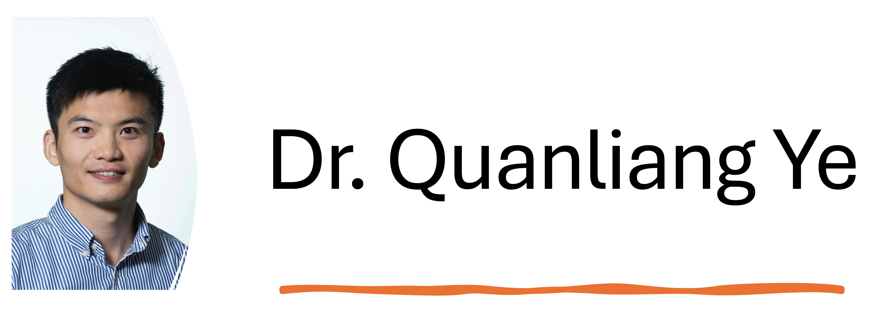

## About ME
I am a [Research Scholar](https://iiasa.ac.at/staff/quanliang-ye) in the [IIASA Energy, Climate, and Environment Program](https://iiasa.ac.at/programs/ece). 

My research focuses on environmental impact assessment, climate change mitigation, and climate change policy analysis. As part of this work, I have been conducting in-depth research on the multi-dimensional impacts of climate change on industries and ecosystems. I developed advanced environmental impact assessment models, such as capital endogenous input-output models and system dynamics-based integrated assessment models (IAMs). These models not only combine multidisciplinary theories but also apply big data analysis techniques, thus improving both the accuracy and applicability of environmental impact assessments. My work has been published in a variety of journals, including [Nature Communications](https://www.nature.com/articles/s41467-023-38358-z), [Environmental Science & Technology](https://pubs.acs.org/doi/10.1021/acs.est.0c07263), etc. My ultimate goal is to provide a credible scientific basis for decision making and policymaking in global and national sustainable development.

I obtained a PhD in environmental science from University of Twente in the Netherlands. After that, I worked as a postdoctoral researcher at Aalborg University in Denmark and Radboud University in the Netherlands. I has been contributing to a number of national and international climate-related projects, including the EU Horizon project [WorldTrans](https://worldtrans-horizon.eu/), [CHOICE](https://www.climatechoice.eu/), and a Danish project [Getting The Data Right](https://bonsai.uno/). I am also a member of the Youth Editorial Board of Carbon Footprints journal, and a review editor for Frontiers in Environmental Science.

A recent CV can be found here, in [English](pdf_cv_english.html) or in [Chinese](pdf_cv_chinese.html)

## Contact Information
Email: yequanliang1993@gmail.com

LinkedIn: [Quanliang Ye](https://www.linkedin.com/in/quanliang-ye-7112ab197/)

: [LinkedIn](https://www.linkedin.com/in/quanliang-ye-7112ab197/)

Google Scholar: [Quanliang Ye](https://scholar.google.com/citations?user=WNgSJnsAAAAJ)

ORCID: [0000-0002-6135-3403](https://orcid.org/my-orcid?orcid=0000-0002-6135-3403)
