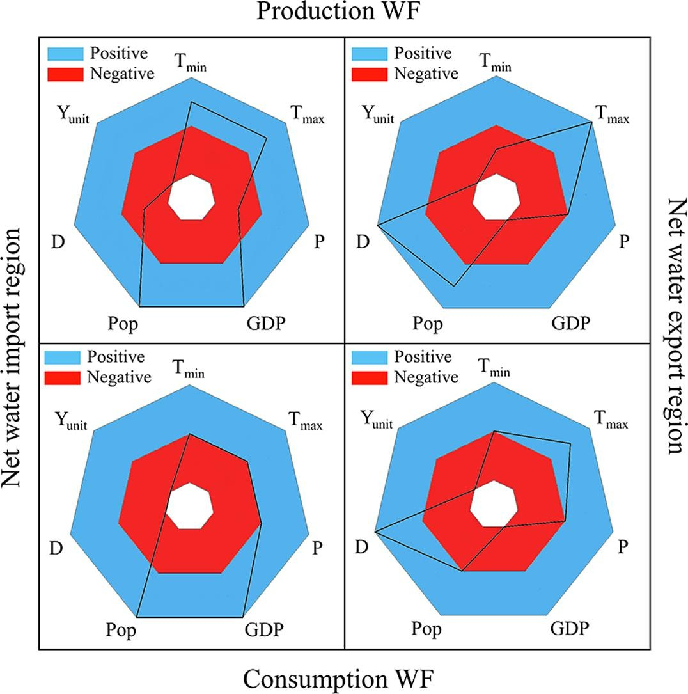
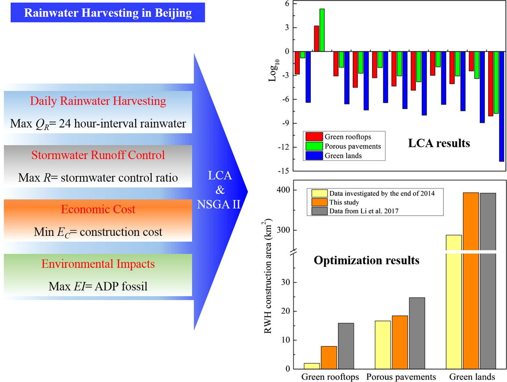
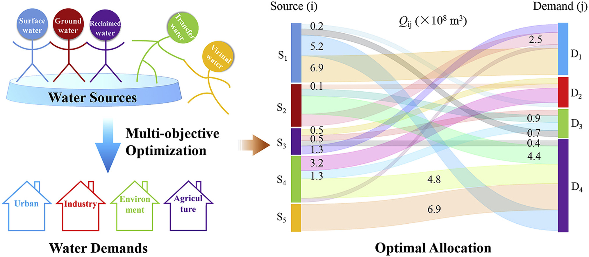
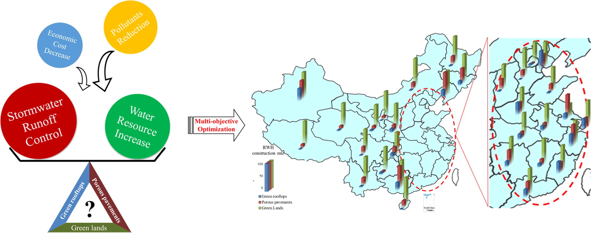

## Influential factors on water footprint: A focus on wheat production and consumption in virtual water import and export regions

**Quanliang Ye**, Yi Li, Wenlong Zhang, Wei Cai

*Ecological Indicators* **102**, 309-315, [10.1016/j.ecolind.2019.02.051](https://doi.org/10.1016/j.ecolind.2019.02.051)

**Abstract** Agriculture is a key sector and a major consumer of water resources; therefore, a clear understanding of the agricultural water demand for crop production and consumption is imperative for addressing water scarcity problems, particularly in water export regions. This study provides new insights into the influential factors driving the changes in the agricultural production water footprint (WFprod) and consumption water footprint (WFcon) in the net water import and net water export regions. The WFprod and WFcon of wheat are evaluated in Beijing city (the net water import region) and Heilongjiang province (the net water export region) over the period 1996–2015. The statistical significances of the influential factors, i.e., climate change, gross domestic product, population, dietary demand and technology update are determined using a multivariate linear regression model (LRM) and nonlinear regression model (NLRM). The results indicate that the gross domestic product and population were the dominant positive influential factors, whereas technology update and dietary demand were the dominant negative influential factors affecting the changes in the WFprod and WFcon in the net water import region. In the net water export region, technology update was the dominant negative influential factor affecting the changes in the WFprod and WFcon. Climate change did not contribute significantly to the changes in the WFprod and WFcon of wheat; however, it was an important factor (especially precipitation for the green WF with an average relative importance of more than 22% and the blue WF with an average relative importance of more than 15%) affecting the changes in the WFprod and WFcon of the crop. An in-depth analysis of the influential factors that contribute to the changes in the WFs is fundamentally important for decision-makers to develop countermeasures and strategic planning implementations to mitigate water resource pressure in China.

|
|:--|
|Figure. Influential factors on water footprint: A focus on wheat production and consumption in virtual water import and export regions.|

## Multi-objective optimization integrated with life cycle assessment for rainwater harvesting systems

Yi Li, Youyi Huang, **Quanliang Ye**, Wenlong Zhang, Fangang Meng, Shanxue Zhang

*Journal of hydrology* **558**, 659-666, [10.1016/j.jhydrol.2018.02.007](https://doi.org/10.1016/j.jhydrol.2018.02.007)

**Abstract** The major limitation of optimization models applied previously for rainwater harvesting (RWH) systems is the systematic evaluation of environmental and human health impacts across all the lifecycle stages. This study integrated life cycle assessment (LCA) into a multi-objective optimization model to optimize the construction areas of green rooftops, porous pavements and green lands in Beijing of China, considering the trade-offs among 24 h-interval RWH volume (QR), stormwater runoff volume control ratio (R), economic cost (EC), and environmental impacts (EI). Eleven life cycle impact indicators were assessed with a functional unit of 10,000 m2 of RWH construction areas. The LCA results showed that green lands performed the smallest lifecycle impacts of all assessment indicators, in contrast, porous pavements showed the largest impact values except Abiotic Depletion Potential (ADP) elements. Based on the standardization results, ADP fossil was chosen as the representative indicator for the calculation of EI objective in multi-objective optimization model due to its largest value in all RWH systems lifecycle. The optimization results for QR, R, EC and EI were 238.80 million m3, 78.5%, 66.68 billion RMB Yuan, and 1.05E + 16 MJ, respectively. After the construction of optimal RWH system, 14.7% of annual domestic water consumption and 78.5% of maximum daily rainfall would be supplied and controlled in Beijing, respectively, which would make a great contribution to reduce the stress of water scarcity and water logging problems. Green lands have been the first choice for RWH in Beijing according to the capacity of rainwater harvesting and less environmental and human impacts. Porous pavements played a good role in water logging alleviation (R for 67.5%), however, did not show a large construction result in this study due to the huge ADP fossil across the lifecycle. Sensitivity analysis revealed the daily maximum precipitation to be key factor for the robustness of the results for three RWH systems construction in this study.

|
|:--|
|Figure. Multi-objective optimization integrated with life cycle assessment for rainwater harvesting systems|

## Optimal allocation of physical water resources integrated with virtual water trade in water scarce regions: A case study for Beijing, China

**Quanliang Ye**, Yi Li, La Zhuo, Wenlong Zhang, Wei Xiong, Chao Wang, Peifang Wang

*Water Research* **129**, 264-276, [10.1016/j.watres.2017.11.036](https://doi.org/10.1016/j.watres.2017.11.036)

**Abstract** This study provides an innovative application of virtual water trade in the traditional allocation of physical water resources in water scarce regions. A multi-objective optimization model was developed to optimize the allocation of physical water and virtual water resources to different water users in Beijing, China, considering the trade-offs between economic benefit and environmental impacts of water consumption. Surface water, groundwater, transferred water and reclaimed water constituted the physical resource of water supply side, while virtual water flow associated with the trade of five major crops (barley, corn, rice, soy and wheat) and three livestock products (beef, pork and poultry) in agricultural sector (calculated by the trade quantities of products and their virtual water contents). Urban (daily activities and public facilities), industry, environment and agriculture (products growing) were considered in water demand side. As for the traditional allocation of physical water resources, the results showed that agriculture and urban were the two predominant water users (accounting 54% and 28%, respectively), while groundwater and surface water satisfied around 70% water demands of different users (accounting 36% and 34%, respectively). When considered the virtual water trade of eight agricultural products in water allocation procedure, the proportion of agricultural consumption decreased to 45% in total water demand, while the groundwater consumption decreased to 24% in total water supply. Virtual water trade overturned the traditional components of water supplied from different sources for agricultural consumption, and became the largest water source in Beijing. Additionally, it was also found that environmental demand took a similar percentage of water consumption in each water source. Reclaimed water was the main water source for industrial and environmental users. The results suggest that physical water resources would mainly satisfy the consumption of urban and environment, and the unbalance between water supply and demand could be filled by virtual water import in water scarce regions.

|
|:--|
|Figure. Optimal allocation of physical water resources integrated with virtual water trade in water scarce regions.|

## Seeking urbanization security and sustainability: Multi-objective optimization of rainwater harvesting systems in China

Yi Li, **Quanliang Ye**, An Liu, Fangang Meng, Wenlong Zhang, Wei Xiong, Peifang Wang, Chao Wang

*Journal of Hydrology* **550**, 42-53, [10.1016/j.jhydrol.2017.04.042](https://doi.org/10.1016/j.jhydrol.2017.04.042)

**Abstract** Urban rainwater management need to achieve an optimal compromise among water resource augmentation, water loggings alleviation, economic investment and pollutants reduction. Rainwater harvesting (RWH) systems, such as green rooftops, porous pavements, and green lands, have been successfully implemented as viable approaches to alleviate water-logging disasters and water scarcity problems caused by rapid urbanization. However, there is limited guidance to determine the construction areas of RWH systems, especially for stormwater runoff control due to increasing extreme precipitation. This study firstly developed a multi-objective model to optimize the construction areas of green rooftops, porous pavements and green lands, considering the trade-offs among 24 h-interval RWH volume, stormwater runoff volume control ratio (R), economic cost, and rainfall runoff pollutant reduction. Pareto fronts of RWH system areas for 31 provinces of China were obtained through nondominated sorting genetic algorithm. On the national level, the control strategies for the construction rate (the ratio between the area of single RWH system and the total areas of RWH systems) of green rooftops ($$\eta_{GR}$$), porous pavements ($$\eta_{PP}$$) and green lands ($$\eta_{GL}$$) were 12%, 26% and 62%, and the corresponding RWH volume and total suspended solids reduction was 14.84 billion m3 and 228.19 kilotons, respectively. Optimal $$\eta_{GR}$$, $$\eta_{PP}$$, and $$\eta_{GL}$$ in different regions varied from 1 to 33%, 6 to 54%, and 30 to 89%, respectively. Particularly, green lands were the most important RWH system in 25 provinces with $$\eta_{GL}$$ more than 50%, $$\eta_{GR}$$ mainly less than 15%, and $$\eta_{PP}$$ mainly between 10 and 30%. Results also indicated whether considering the objective MaxR made a non-significant difference for RWH system areas whereas exerted a great influence on the result of stormwater runoff control. Maximum daily rainfall under control increased, exceeding 200% after the construction of the optimal RWH system compared with that before construction. Optimal RWH system areas presented a general picture for urban development policy makers in China.

|
|:--|
|Figure. Multi-objective optimization of rainwater harvesting systems in China.|