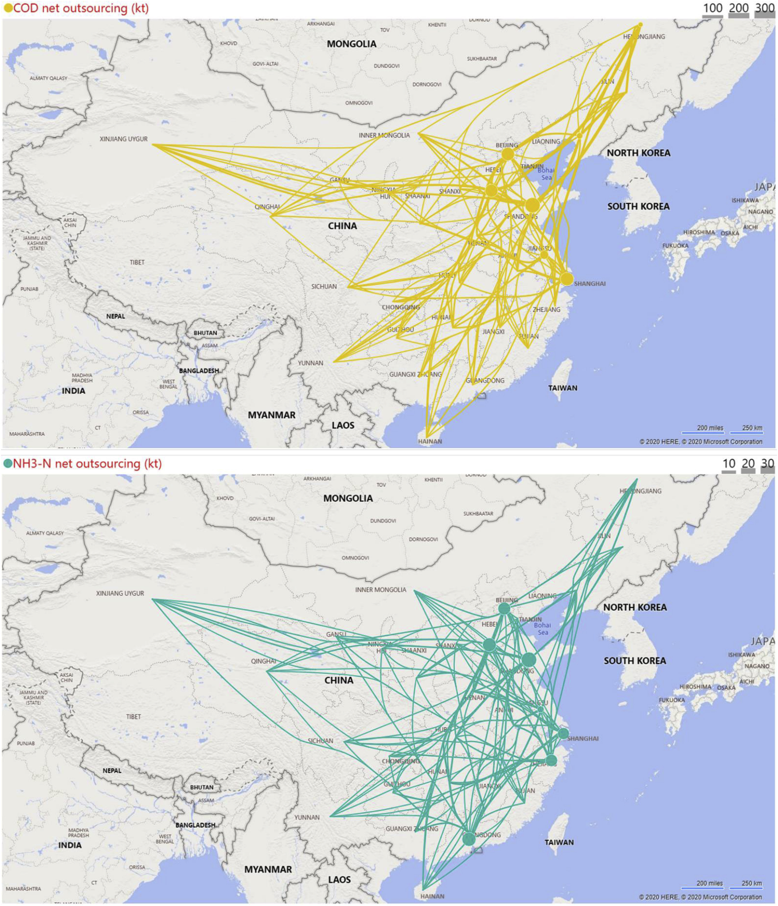

## Water pollution loads and shifting within China's inter-province trade

Zhaodan Wu, **Quanliang Ye**

*Journal of Cleaner Production* **259**, 120879, [10.1016/j.jclepro.2020.120879](https://doi.org/10.1016/j.jclepro.2020.120879)

**Abstract** Inter-province trade of commodities and services involves not only the virtual water flows, but also the water pollution shifting which influences the water quality stress in both import and export provinces. This study estimated the production-based and consumption-based gray water footprints (GWFs) of chemical oxygen demand (COD) and ammoniacal nitrogen ($$NH_3–N$$) of 30 provinces in China, and further elaborated the pollution shifting due to inter-province trade of commodities and services. The national GWF was 1586 billion m3 in 2012, mainly distributed in agriculture-dominated provinces, e.g., Guangdong, Hunan, Henan, Jiangsu, Shandong, Sichuan and Hubei. Our results also found that the national net water pollution shifting volumes were 2.8 million tons of COD and 0.2 million tons of $$NH_3–N$$. Relatively wealthy provinces, such as Beijing, Shanghai and Tianjin, played significant roles in the national net pollution shifting. In accordance with the shifting of COD and $$NH_3–N$$, 525 billion m3 of net GWFs were shifted from the importers to the exporters. Hebei, Shandong and Guangdong were the major outsourcing provinces of GWFs, whereas Hunan, Henan, and Heilongjiang were the major receiving provinces. We also found that most of the major water pollution receiving provinces present severe water quality stresses, particularly for Jiangsu, Henan and Anhui. Our results present the comprehensive water pollution consequences (internal and external) of daily economic activities in each province, and provide scientific instructions for inter-regional environment protection and policy making in China and far beyond.

|
|:--|
|Figure. Net outsourcing flows of embodied COD and $$NH_3–N$$ in the trade of commodity and services from the importing provinces (with bubbles) to the exporting provinces.|