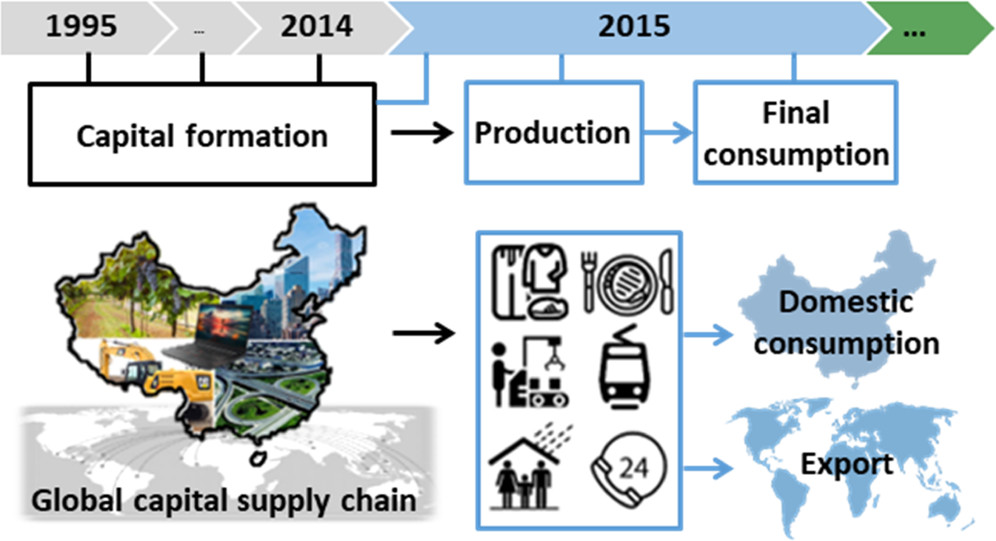
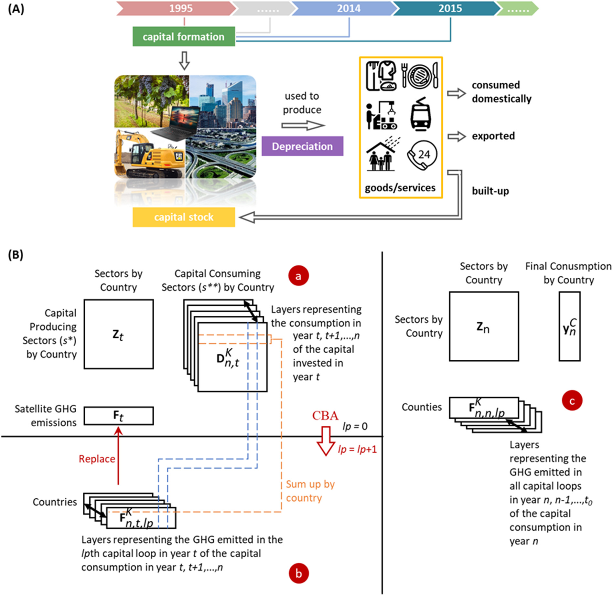

## Linking the Environmental Pressures of China’s Capital Development to Global Final Consumption of the Past Decades and into the Future

Authorship: Quanliang Ye, Edgar G Hertwich, Maarten S Krol, David Font Vivanco, Amanda W Lounsbury, Xinzhu Zheng, Arjen Y Hoekstra, Yutao Wang, Ranran Wang

Journal and DOI: Environmental Science & Technology **55**(9), 6421-6429, [10.1021/acs.est.0c07263](https://doi.org/10.1021/acs.est.0c07263)

**Abstract** China’s rapid growth was fueled by investments that grew more than 10-fold since 1995. Little is known about how the capital assets acquired, while being used in productive processes for years or decades, satisfy global final consumption of goods and services, or how the resource use and emissions that occurred during capital formation are attributable to past or future consumption. Here, enabled by a new global model of capital formation and use, we quantify the linkages over the past 2 decades and into the future between six environmental pressures (EPs) associated with China’s capital formation and attributable to Chinese as well as non-Chinese consumption. We show that only 35% of the capital assets acquired by China from 1995 to 2015, representing 32–39% of the associated EPs (e.g., water consumption, greenhouse gas (GHG) emissions, and metal ore extractions), have been depreciated, while the majority rest will serve future production and consumption. The outsourcing of capital services and the associated EPs are considerable, ranging from 14 to 25% of depending on the EP indicators. Without accounting for the capital–final consumption linkages across time and space, one would miscalculate China’s environmental footprints related to the six EPs by big margins, from −61% to +114%.

|
|:--|
|Figure. Chinese capital development for the global final human needs.|

## Integrating the inter-and intra-annual dynamic features of capital into environmental footprint assessment: Revisiting China's greenhouse gas footprints, 1995-2015

Authorship: Zhaodan Wu, Min Wang, Quanliang Ye

Journal and DOI: Science of the Total Environment **801**, 149629, [10.1016/j.scitotenv.2021.149629](https://doi.org/10.1016/j.scitotenv.2021.149629)

**Abstract** Assessments of the displacement of pollution emissions or other resources through trade attribute local production to remote consumers, yielding environmental footprints for the respective regions. Recently, the previously neglected temporal dimension of capital goods—built up in the past and continuously serving production activities in the future—has received increasing attention in environmental footprint assessments. Based on an inter-annual dynamic capital-endogenised multi-regional input-output model, this study further integrates the intra-annual dynamic features of capital production and consumption. We quantify the greenhouse gas (GHG) emissions embodied in China's capital consumption over the past two decades and assign this part of GHG emissions into finished goods and services over time. Our results show that China's GHG footprint in 2015 would be 7 Gt if capital-related GHG emissions were considered. This figure is 28% higher than the GHG footprints of China's final consumption estimated by conventional consumption-based accounting (CBA) and 41% lower than that of China's final demand estimated by conventional CBA. Overall, around 8% of GHG footprints would be overestimated if we do not consider the intra-annual dynamic feature of capital in the assessment. The inter-annual allocation shows that the capital-related GHGs of China's final consumption emitted on average in the last six years, which is still increasing owing to the long lifespans of capital assets. In light of the synergies among capital development, environmental sustainability, and human needs satisfaction, it is vital to uphold economic and environmental efficiency in capital development decision-making.

|
|:--|
|Figure. Sketch to illustrate the “capital loop” in annual economic production (A), and schematic for the procedures to integrate capital consumption into consumption-based accounting (CBA) based on the multi-regional input-output (MRIO) model (B).|