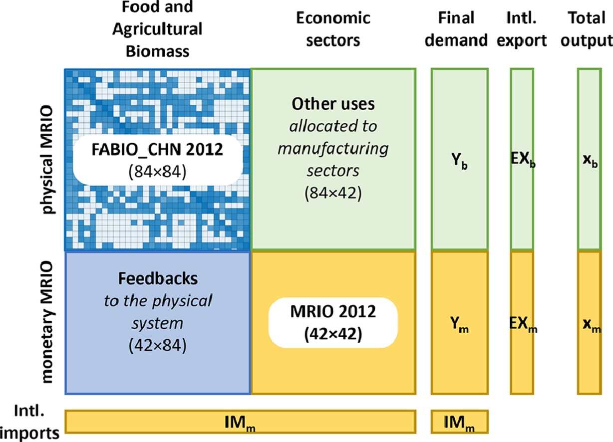

## A hybrid multi-regional input-output model of China: Integrating the physical agricultural biomass and food system into the monetary supply chain

Authorship: Quanliang Ye, Martin Bruckner, Ranran Wang, Joep F Schyns, La Zhuo, Lan Yang, Han Su, Maarten S Krol

Journal and DOI: Resources, Conservation and Recycling **177**, 105981, [10.1016/j.resconrec.2021.105981](https://doi.org/10.1016/j.resconrec.2021.105981)

**Abstract** Lacking systematic supply-use information of agricultural biomass and food products within China makes the existing provincial environmental pressure assessments (e.g., water consumption) either not detailed enough (e.g., by the input-output table-based approach) or not comprehensive enough (e.g., by the process-based approach). This study develops a symmetric inter-provincial multi-regional input-output (MRIO) model that hybridizes the physical food and agricultural biomass system with the monetary supply chain of China. First, we construct the inter-provincial supply, use, and input-output tables in physical units of 84 agriculture, food and forestry products. These physical supply/use/MRIO tables systematically capture agri-food product flows, at an unprecedented level of product detail, along domestic supply chains within China. Then we integrate the physical MRIO table of agri-food products into the monetary all-sector MRIO table to construct a symmetric hybrid MRIO table of China. The application of our hybrid MRIO model to the case of provincial blue water footprint assessments reveals that the hybrid model enhances both the monetary MRIO table-based approach and the process-based approach from different aspects. For instance, the hybrid MRIO model can reduce the uncertainty of monetary MRIO modeling due to the aggregation of products with different environmental properties into homogeneous sectors. Lastly, uncertainty analysis is implemented to quantify the main sources of uncertainties, and understand the reliability of our new hybrid MRIO model for future sustainable development design.

|
|:--|
|Figure. Structure of a symmetric hybrid input-output (IO) table. FABIO stands for food and biomass input output.|

