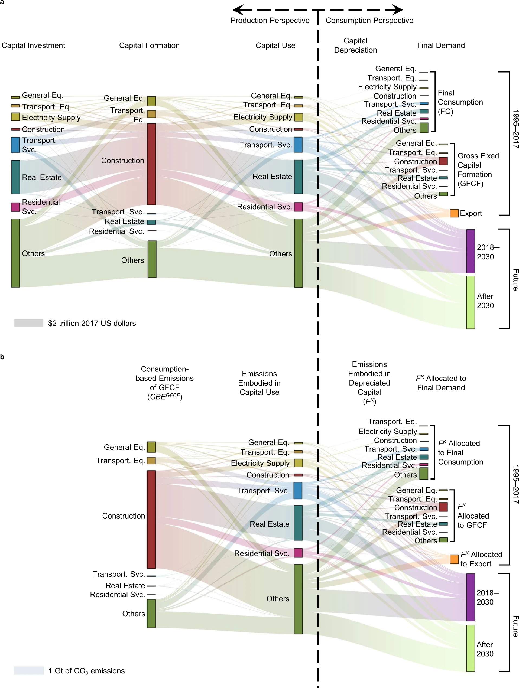

## Allocating capital-associated CO2 emissions along the full lifespan of capital investments helps diffuse emission responsibility

**Quanliang Ye**, Maarten S. Krol, Yuli Shan, Joep F. Schyns, Markus Berger, Klaus Hubacek

*Nature communications* **14**(1), 2727, [10.1038/s41467-023-38358-z](https://doi.org/10.1038/s41467-023-38358-z)

**Abstract** Capital assets such as machinery and infrastructure contribute substantially to CO2 emissions over their lifetime. Unique features of capital assets such as their long durability complicate the assignment of capital-associated CO2 emissions to final beneficiaries. Whereas conventional approaches allocate emissions required to produce capital assets to the year of formation, we propose an alternative perspective through allocating required emissions from the production of assets over their entire lifespans. We show that allocating CO2 emissions embodied in capital assets over time relieves emission responsibility for the year of formation, with 25‒46% reductions from conventional emission accounts. This temporal allocation, although virtual, is important for assessing the equity of CO2 emissions across generations due to the inertia of capital assets. To re-allocate emission responsibilities to the future, we design three capital investment scenarios with different investment purposes until 2030. Overall, the existing capital in 2017 will still carry approximately 10% responsibilities of China’s CO2 emissions in 2030, and could reach more than 40% for capital-intensive service sectors.

|
|:--|
|Figure. Capital and CO2 flows along economic activities and time. **a** Monetary capital flows across key sectors of China’s capital development. **b** Embodied CO2 transfers across key sectors of China’s capital development.|

