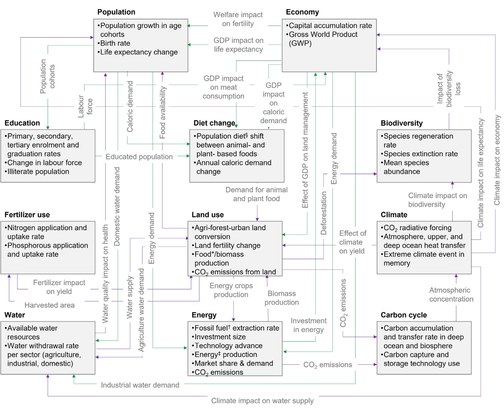

## FeliX 2.0: An integrated model of climate, economy, environment, and society interactions

Authorship: Quanliang Ye, Qi Liu, Deepthi Swamy, Lei Gao, Enayat A. Moallemi, Felicjan Rydzak, Sibel Eker

Journal and DOI: Environmental Modelling & Software **179**, 106121, [10.1016/j.envsoft.2024.106121](https://doi.org/10.1016/j.envsoft.2024.106121)

**Abstract** The Full of Economic-Environment Linkages and Integration dX/dt (FeliX) model is a System Dynamics-based Integrated Assessment Model (IAM), explicitly incorporating human behaviors and their dynamic interactions among global systems. This paper presents FeliX 2.0, describing the detailed framework and key interactions among nine integrated modules. FeliX 2.0 refined its original version in population dynamics, food and land use systems, and socioeconomic settings for poverty analysis. Robust calibration is applied to key variables against their historical data since 1950. Future projections of multiple variables up to 2100 demonstrate coherences between FeliX 2.0 and the IAMs used in IPCC assessments. Both outputs (the robust calibration results and future projections) underscore the efficacy of FeliX 2.0 in capturing complex interdependencies within global systems. FeliX 2.0 stands as an informative tool and offers insights into interactions within the human-Earth system and the analysis of complex economic-environmental-social challenges in short- and long-term future.

|
|:--|
|Figure. Overview of the FeliX model. Interactions within and among the modules are shown in this figure.|

## Promoting intergenerational equity calls for strategic investments in long-lasting capital systems

Authorship: Quanliang Ye, Yuli Shan, Klaus Hubacek

Journal and DOI: Cell Reports Sustainability **1**(9), [10.1016/j.crsus.2024.100153](https://doi.org/10.1016/j.crsus.2024.100153)

**Abstract** The long-term capital system is essential for promoting equity between current and future generations. However, the distribution of capital assets between generations is often unfair and unjust. This commentary discusses interactions among three types of long-term capital, namely natural, manufactured, and human capital, and emphasizes the need for strategic investments that transcend each type of capital to promote equitable development between generations.

|
|:--|
|Figure. Capital system: relationships and interactions between natural, manufactured, and human capital toward intergenerational equity.|
